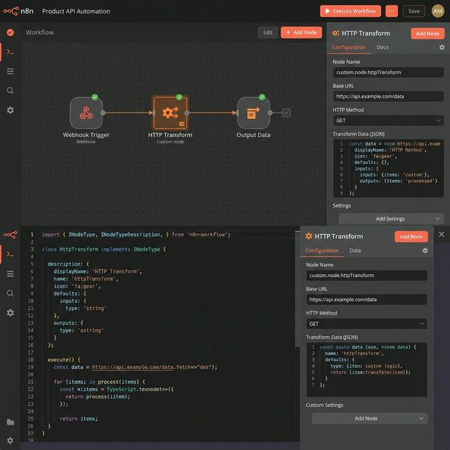

# Custom n8n Integration Node (HTTP Transform)

A custom-built n8n node designed to seamlessly fetch data from any external API, transform the payload, and inject it cleanly into your automation workflows.

✔ Saves hours of manual coding by providing a no-code visual interface for complex API integrations
✔ Prevents workflow failures by structuring and sanitizing messy third-party JSON data instantly
✔ Plug-and-play architecture perfectly integrates into any existing n8n deployment

## Use Cases
- **Custom Integrations:** Connect legacy or proprietary APIs to your n8n workflows without writing intermediate scripts.
- **Data Transformation:** Standardize payloads from multiple different webhooks before injecting them into a central database.
- **Workflow Optimization:** Replace complex function nodes with a single, highly-optimized custom module.

---

## Tech Stack

- **TypeScript** — strict typing throughout
- **n8n node API** — INodeType, IExecuteFunctions, INodeProperties
- **Custom credentials** — API key via n8n credential store
- **Build system** — tsc with n8n-compatible output

---

## Installation

### Prerequisites
- Node.js 18+
- n8n installed (local or self-hosted)
- TypeScript: `npm install -g typescript`

### Setup

```bash
git clone https://github.com/bck-stack/n8n-custom-node
cd n8n-custom-node
npm install
npm run build
```

### Link to n8n

**Option A — Custom nodes directory:**
```bash
# Copy built files to n8n custom nodes folder
cp -r dist/ ~/.n8n/custom/
```

**Option B — npm link (development):**
```bash
npm link
cd ~/.n8n
npm link n8n-nodes-http-transform
```

Restart n8n — the "HTTP Transform" node will appear in the node panel.

---

## Project Structure

```
n8n-custom-node/
├── nodes/
│   └── HttpTransform/
│       └── HttpTransform.node.ts   # Main node implementation
├── credentials/
│   └── HttpTransformApi.credentials.ts  # API key credential
├── package.json                    # n8n node manifest
├── tsconfig.json                   # TypeScript config
└── README.md
```

---

## Node Parameters

| Parameter | Type | Description |
|-----------|------|-------------|
| URL | String | Target API endpoint |
| Method | Options | GET / POST / PUT |
| Auth Token | String | Bearer token (from credentials) |
| Field Mappings | Fixed Collection | input_field → output_field renames |
| Additional Headers | Fixed Collection | Extra request headers |

---

## Example Output

```json
{
  "id": 42,
  "product_name": "Widget Pro",
  "price_usd": 29.99,
  "in_stock": true,
  "_source": "https://api.example.com/products/42",
  "_fetched_at": "2025-01-15T10:30:00Z"
}
```

---

## Development

```bash
# Watch mode — auto-recompile on change
npm run dev

# Build for production
npm run build

# Lint
npm run lint
```

---

## Credential Setup in n8n

1. Open n8n → Settings → Credentials
2. Create new → "HTTP Transform API"
3. Enter your API key/token
4. Reference the credential in the node

---

## Example Workflow Use Case

```
[Schedule Trigger] → [HTTP Transform] → [Set] → [Google Sheets]
```
Fetch product data every hour, rename fields to match your sheet columns, append rows automatically.

---

## License

MIT

## Screenshot



